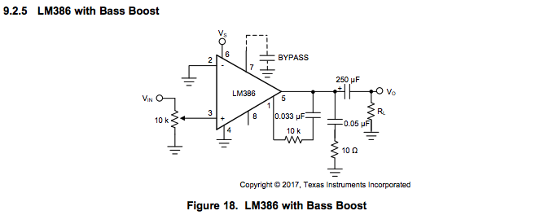

# SI4844 FM Radio

This is an FM radio using the digital reciever module ```Si4844```. 

- [All About Circuits](http://www.allaboutcircuits.com/projects/build-an-arduino-controlled-am-fm-sw-radio/) - this is the original blog post about setting up radio
- [Design Guide](http://www.silabs.com/Support%20Documents/TechnicalDocs/AN602.pdf)
- [Programming Guide](http://www.silabs.com/Support%20Documents/TechnicalDocs/AN610.pdf)

## STATUS

- [x] Circuit Power
- [x] I2C Communication
- [x] Si4844 power
- [x] FM demodulation
- [x] Basic functionality

To do:
- [ ] Add Band switch
- [ ] Add display
- [ ] On/Off switch
- [ ] Audio out (?)
- [ ] Move to protoboard
- [ ] Enhanced audio amplifier
- [ ] Enhanced AM/FM antenna
- [ ] Buy knobs/dials
- [ ] [Enclosure](https://s-media-cache-ak0.pinimg.com/originals/ba/01/3a/ba013af739433c9e4d94a3727d0fa14c.jpg)


## Build Notes

**Microcontroller** - The original blog post uses an Arduino 3.3v Pro Mini.  I dont have one of these so instead I'm using a Teensy 3.2.  The main reason I'm going with the Teensy is that it's also a 3.3v board.  I've also thought about using a ```3.3v Trinket Pro``` but I dont have my 3.3v-5v serial adapter.  The ```Teensy 3.2``` has built in serial converter.

**Power** - it is suggested to power the whole board from a 3.3v regulator and not the microcontroller as the microcontroller will not supply enough amps.

**Communication** - the ```Si4844``` is an I2C slave device with an address ```0x11```.  The ```Si4844``` maximum speed is 50kHz and during some parts of the startup phase, the speed must not exceed 10kHz.  With Arduino, you can use the ```Wire``` library and change the I2C speed with ```Wire.setClock(10000)``` which sets the I2C clock speed to 10k.  I used 2.2k pullup resistors for both the SDA and SCK lines.

**Audio** - I'm using a basic audio amplifyer circut using the LM386.  The schematics is:



**Antenna** - The setup works without any 'official' antenna.  I basically have a 6 inch wire twisted once which is providing quality reception.

## Parts

- [ ] [Si4844-B20](http://www.digikey.com/product-detail/en/silicon-labs/SI4844-B20-GU/SI4844-B20-GU-ND/4069445) - Receiver
- [ ] [TPA3123](http://www.digikey.com/product-detail/en/texas-instruments/TPA3123D2PWPR/296-22008-1-ND/1649103) - Class D Audio Amp

## Final Design

- [ ] On/Off toggle
- [ ] Excellent stereo audio quality
- [ ] Volume knob
- [ ] FM Tuning Knob
- [ ] External antenna option

## Misc Parts

Radio dial inspiration comes from a [1934-36 Zenith 5-S-29](https://s-media-cache-ak0.pinimg.com/564x/3f/08/86/3f08869ec74c9f22957f4a435a4101e7.jpg).  [Here](http://www.radioblvd.com/ZenithPhoto.htm) is a list of all Zenith models.

- [ ] Escutcheone
- [ ] Zenith 6-2-229 Chasis
- [ ] Knobs

### Useful Links

- [Dial Cord String Guide](http://www.theoldradiofixerupperguy.com/dial%20cord.html)
- [Old Radio Zone](http://www.oldradiozone.com/zenith.html)
- [Phil's Old Radios](https://www.antiqueradio.org/wooden.htm)
